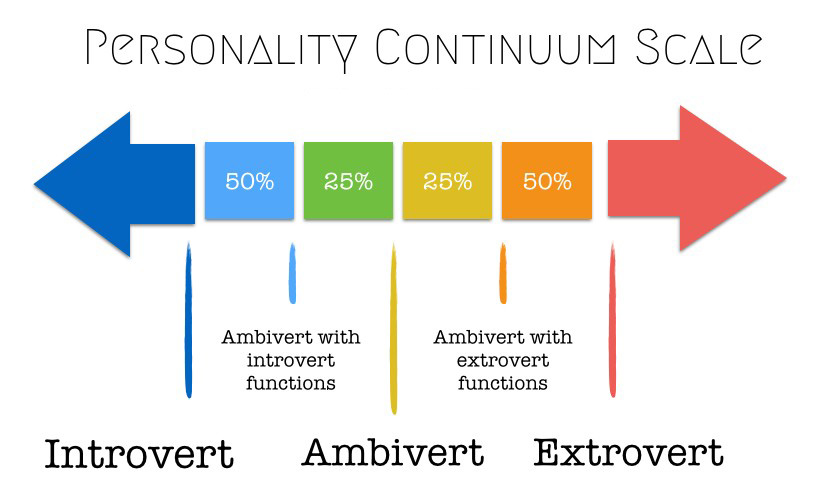

# **"Trait Predictor Project" _by Nomads_**

## **Founders:** Henry Tirado, Scott Seely, Sushma Kesamsetty
---

## **Objective**:
---

Our Project objective was to develop the machine learning application that would predict the personality trait of a person as Introvert/Extrovert/Ambivert based on 91 personality questions. Our ML algorithm is trained based on survey with the same set of personality questions. 

http://ie-predictor.tech/

**_Introvert_**:  Introverts may prefer taking part in less stimulating activities and get pleasure from activities such as reading, writing or meditating.  Introverts typically prefer to concentrate on a single activity, analyze situations carefully and take time to think more before they speak.

**_Extrovert_**:  Extroverts usually prefer to seek out as much social interaction as possible because this is how they feel more energized. According to estimates, extroverts outnumber introverts by about three to one (Cain, 2012).

**_Ambivert_**:  Introversion/extroversion isn't an all-or-nothing trait; it's actually a continuum and some people might be very extroverted while others are less so.
An ambivert is a person who shows characteristics of both extroversion and introversion. In other words, they fall somewhere in the middle of the scale. People who are ambiverts are said to be moderately comfortable in social situations but also enjoy some solitary time.

---
## **Use Cases**:
---
Personality data has many commercial uses.
- Company hiring
- Dating sites
- Entertainment
- Career counseling

---
## **Configuration Requirements**:
---

When training and testing the model in the Jupyter notebook, it expects DB configuration to fetch the survey data.

    Create a file "config.py" in the folder "code". Add and fill Username, Password, Host and Port in the file.
      driver='postgresql'
      username=
      password=
      host= 
      port= 
      database="postgres" 

---        
## **Library Requirements and Tools**:
---

- AWS RDS
- Postgresql
- Python
- Pandas
- Jupyter Notebook
- Scikit Learn
- Matplotlib
- HTML/CSS
- JavaScript
- SQLAlchemy
- D3
- Flask
- Tableau
- Heroku

---
## **Data Source**: 
---
- https://www.kaggle.com/yamqwe/introversionextraversion-scales

The questionaire contains 91 questions and 3 demographic identifiers. The questions were presented one at a time in a random order. For each questions 3 values were recorded:

A - The user's selected response. 1=Disagree, 2=Slightly disagree, 3=Neutral, 4=Slightly agree, 5=Agree
I - The position of the question in the survey.
E - The time elapsed on that question in milliseconds.

  

---
## **Visualization**:
---

Tableau

---
## **Application Design**:
---
(https://ie-predictor.herokuapp.com/)
---
### **Machine Learning**:
---

To predict the personality trait of a person, we have trained our model using the data from 91 Questions survey taken by more than 7000 users (Data source: Kaggle).

First and foremost, to validate the dataset, we applied Unsupervised ML Algorithm - K-Means clustering to our Preprocessed data. The elbow curve plotted out of this cleansed data showed us there would 3 Clusters in the dataset. Proves that we were looking for the classes 1:Introvert, 2:Extrovert and 3:Ambivert.

To train our Machine learning model, We started with Random Forest classifier to make the predictions. Even after trying various hyperparameters, accuracy of our predictions remained to be around 72%.

The diagonal values of the confusion matrix show True predictions, attributed as True Introverts (Predicted#1307 Vs Actual#1422), True Extroverts (Predicted#193 Vs Actual#345) and True Ambiverts (Predicted#211 Vs Actual#594). Remaining numbers in the matrix show False predictions (False Introverts, False Extroverts, False Ambiverts).

As part of Accuracy improvement efforts, we trained our Machine Learning model using some other algorithms.

_Logistic Regression_: Had better accuracy both with Raw data and Standard scaled data.

_Linear Regression_: Performed very bad and this algorithm would not be considered for training by any means.

_Bagging & Boosting_: Using Bagging classifier, performed both Bagging (Hyper parameter: bootstrap=True) and Pasting (Hyper parameter: bootstrap=False). Bagging has the similar accuracy as Logistic Regression and Random Forest. Even with Bagging, accuracy was better with unscaled raw data. Tried AdaBoost, resulting in the similar accuracy score.

_Voting Classifier_: By definition of Voting classifier, it provides a way to create a better classifier by aggregating the predictions of each classifier and predict the class that gets the most votes. So I used Logistic Regression, Random Forest, Support Vector Machine, Bagging and Boosting classifier. Accuracy reached only upto 73% even with all the ML algorithms.

Hence we sticked on to using Random Forest Classifier for our application.

So, finally, the trained model is saved using Pickle.

---
### **Designing and Deploying the App**:
---
The web app is written using Python, HTML, and JavaScript mainly.  

It uses D3 to read in the list of questions from our database and dynamically generate the HTML code for the questionnaire page.  

Upon clicking the submit button, Flask and Python unpickle the trained model and save the responses in a Pandas 1x91 DataFrame.  The DataFrame is run through the model to let the model predict the user's personality trait.

A results page displays the model's prediction in a Jumbotron element.

---
### **Visualizations**:
---
Participant demographic dashboards were produced in Tableau Public.

---
### **Observations**:
---

Interesting to note is that more introverts participated and gave the surveyors permission to use their responses in the research than the other two categories, despite extroverts outnumbering introverts by 3 to 1.

The participants were mostly GenZ followed by Millenials, and more females participated than males.  The participant country counts demonstrated that we would not use this feature to train since population distribution was not accurately reflected.

Some questions produced stronger responses than others for each trait. Introverts favor 1 on 1 interactions and spending time with their hobbies and prefer listening to people in conversations.  Extroverts admitted they love to laugh a lot, stand up for themselves, love excitement, and have strong personalities.  Ambiverts were neutral for most questions but were in strong agreement to loving excitement and laughing a lot.
****

## **References**:

